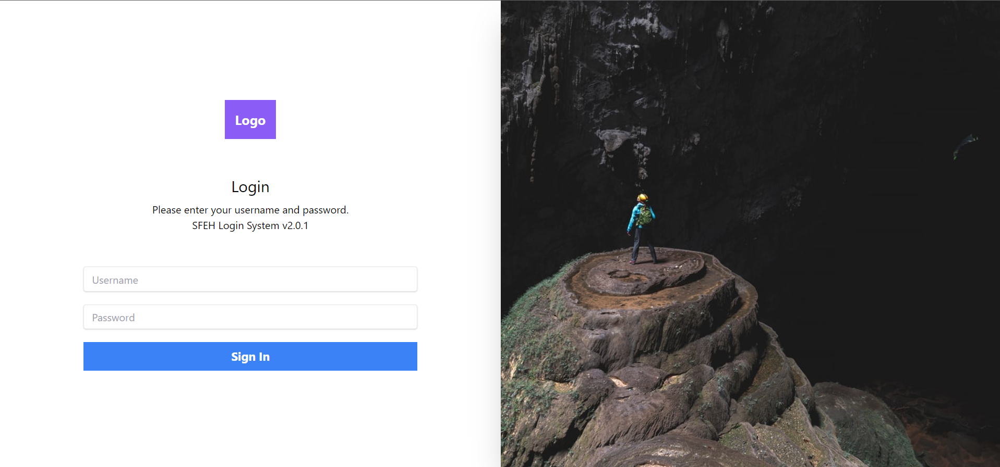

# SvelteJs Login Page with Typescript and Axios

You must start json-server first for login post request.

## Get started

```bash
json-server ./src/mock-data.json --middlewares ./src/middleware.js
```

...then start [Rollup](https://rollupjs.org):

```bash
npm run dev
```

Example Login

-   username: johndoe123
-   password: 123456

## Screen Shot


